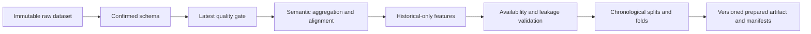
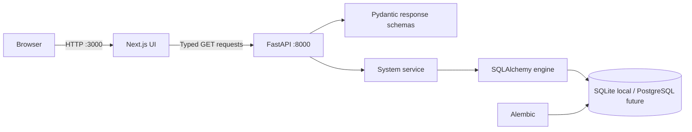
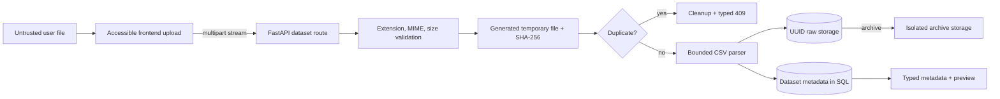
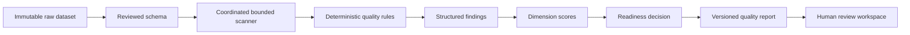

# Phase 1–2D Architecture

## Governed preparation pipeline

Preparation verifies the raw SHA-256 checksum, writes artifacts atomically, and records source, schema, quality, transformation, feature, and split lineage. Failed runs clean temporary files and preserve the previous completed version. No transformation mutates raw data or evaluates user expressions.

Phase 1 separates presentation, transport, application service, and persistence concerns. The browser fetches only health and system-readiness resources; demo dashboard values are local and explicitly labeled.

## Frontend/backend interaction

`frontend/lib/api.ts` enforces a five-second timeout and maps failures to a safe unavailable state. TypeScript interfaces mirror Pydantic response models. Browser-facing configuration uses `NEXT_PUBLIC_API_BASE_URL`; no server secret crosses this boundary.

## Database layer

The engine, session factory, dependency, connectivity probe, and dialect label are centralized in `backend/app/core/database.py`. SQLite is the zero-configuration default. The URL-driven engine and SQLAlchemy models support a later PostgreSQL transition. Alembic contains an initial optional internal metadata migration; current endpoints require no business tables.

## Data flow and security boundaries

The browser is untrusted. FastAPI validates configuration and serializes every successful response through a schema. CORS allows configured origins only and rejects wildcards. Unexpected errors are logged server-side and returned as generic messages. Phase 1 has no authentication, uploads, user code execution, ML computation, or sensitive-data workflow.

## Future modules

Data intelligence, forecasting, calibration, causal intelligence, scenario simulation, optimization, and RAG/agent orchestration remain isolated planned modules. They should enter behind versioned schemas and independently testable services.

## Governed ingestion flow

The storage service resolves a configured root, accepts only generated filenames, checks containment, streams 1 MB chunks, and cleans temporary or committed files after validation/database failure. Parsing uses Python's CSV module without DataFrames or full-file memory loading. Preview rows are bounded derived metadata; the immutable raw file remains authoritative. Database rows store relative keys only, while response schemas omit all internal keys and stored names.

Trust boundaries are explicit: browser validation is convenience only; the backend is authoritative. CSV content is never executed or rendered as HTML. Archiving moves the raw object before marking its row archived, with restoration on metadata transaction failure. Malware scanning, authentication, authorization, and cloud object storage remain future controls.

## Phase 2B schema architecture

Physical profiling, semantic inference, and confirmed mappings are separate layers. A bounded scanner computes primitive types and limited statistics in one pass. Deterministic rules combine normalized-name, type, distribution, and relationship evidence. Proposals and audit events are derived, versioned records; reruns supersede but never erase history.

Responses expose only truncated samples and bounded statistics. Inference does not log values, expose storage keys, mutate files, execute content, or call external AI. Authentication is deferred; audit actors are `system` and `local_user`.

## Phase 2C quality architecture

One coordinated bounded scan updates column statistics, hashes row fingerprints, parses the primary timeline, and evaluates mapped metric relationships. A centralized registry emits structured findings; deterministic scoring converts persisted severity/category into dimension scores and a blocker-aware readiness decision. Only successful reports supersede history.

Evidence contains counts, ratios, thresholds, aggregate ranges, and capped row indices—not complete records. No mutation, automatic cleaning, formula execution, external AI call, or forecasting claim occurs.
