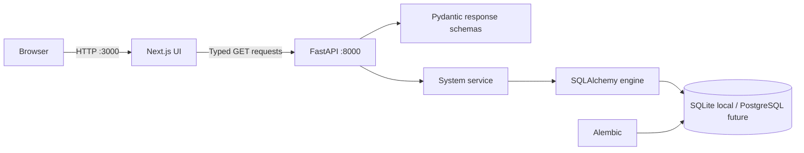

# Phase 1 Architecture

Phase 1 separates presentation, transport, application service, and persistence concerns. The browser fetches only health and system-readiness resources; demo dashboard values are local and explicitly labeled.

## Frontend/backend interaction

`frontend/lib/api.ts` enforces a five-second timeout and maps failures to a safe unavailable state. TypeScript interfaces mirror Pydantic response models. Browser-facing configuration uses `NEXT_PUBLIC_API_BASE_URL`; no server secret crosses this boundary.

## Database layer

The engine, session factory, dependency, connectivity probe, and dialect label are centralized in `backend/app/core/database.py`. SQLite is the zero-configuration default. The URL-driven engine and SQLAlchemy models support a later PostgreSQL transition. Alembic contains an initial optional internal metadata migration; current endpoints require no business tables.

## Data flow and security boundaries

The browser is untrusted. FastAPI validates configuration and serializes every successful response through a schema. CORS allows configured origins only and rejects wildcards. Unexpected errors are logged server-side and returned as generic messages. Phase 1 has no authentication, uploads, user code execution, ML computation, or sensitive-data workflow.

## Future modules

Data intelligence, forecasting, calibration, causal intelligence, scenario simulation, optimization, and RAG/agent orchestration remain isolated planned modules. They should enter behind versioned schemas and independently testable services.
